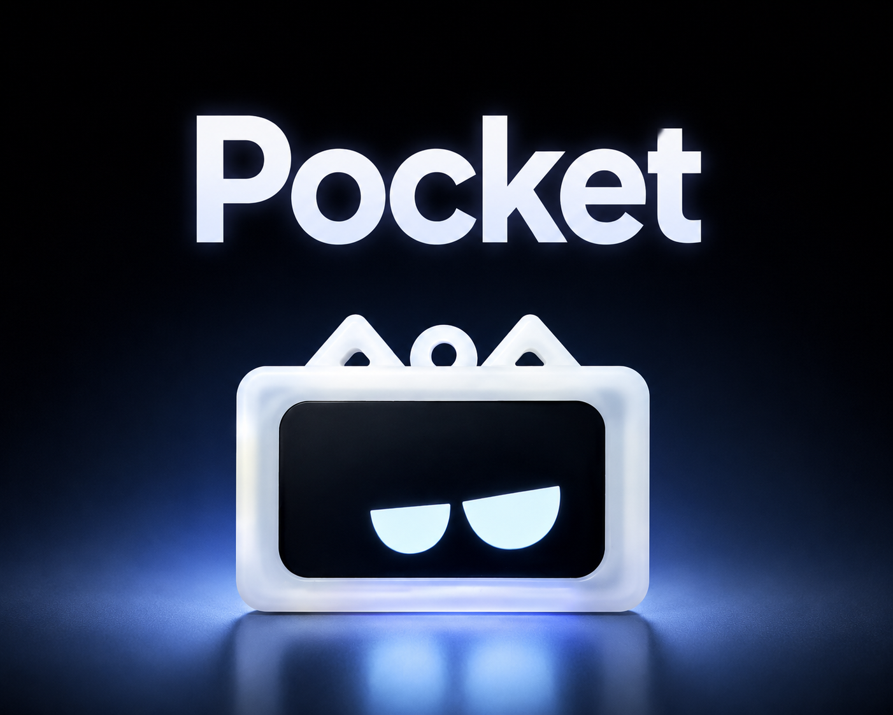

<div align="center">
  
</div>

<h1 align="center">Pocket V1.0 表情挂件</h1>

<p align="center"><b>一个带动画表情、要换换下唤醒和 USB-C 充电的桌面/背包小挂件</b></p>

<p align="center">
  <a href="#-概览">概览</a> &nbsp;|&nbsp;
  <a href="#-实物展示">展示</a> &nbsp;|&nbsp;
  <a href="#-仓库总览">仓库</a> &nbsp;|&nbsp;
  <a href="#-快速开始">快速开始</a> &nbsp;|&nbsp;
  <a href="#-链接">链接</a>
</p>

<p align="center"><a href="README_EN.md"><b>English</b></a></p>

<p align="center">
  
  
  
  
  
</p>

---

## 📖 概览

Pocket 是一只**比拇指稍大的电子小挂件**，挂在包上、放在桌边都合适。

它肚子里塞了一块 ESP32-C3 芯片和一块 1.47 寸 IPS 圆角屏，会随机播放 6 种手绘表情动画——愤怒、不屑、惊恐、兴奋、难过，还有一个眨眼的静态脸。插上 USB-C 充电时还会自动切到充电动画。

你不理它 10 秒它就闭眼熄屏省电，轻轻**晃一下立刻醒来**，换个表情继续陪你。外壳是 3D 打印的猫耳造型，Rhino 源文件和 STL 都开源。

硬件、固件、动画源文件、3D 外壳——**全套开源**。可以直接用预编译固件一键烧录，也可以自己改代码、画新表情、打印新外壳。

<p align="center">
  <table align="center">
    <tr align="center">
      <td width="110"><b>🧠 主控</b><br>ESP32-C3FN4<br><sub>RISC-V</sub></td>
      <td width="110"><b>📺 屏幕</b><br>1.47" IPS<br><sub>172×320</sub></td>
      <td width="110"><b>🎯 陀螺仪</b><br>LSM6DS3TRC<br><sub>六轴 IMU</sub></td>
      <td><b>🔋 充电</b><br>TP4057<br><sub>USB-C</sub></td>
      <td><b>🎨 表情</b><br>6 种 GIF<br><sub>+AE 源文件</sub></td>
      <td><b>🖨️ 外壳</b><br>3D 打印<br><sub>猫耳造型</sub></td>
    </tr>
  </table>
</p>

---

## 📸 实物展示

<p align="center">
  <table align="center">
    <tr align="center">
      <td></td>
      <td></td>
      <td></td>
    </tr>
    <tr align="center">
      <td></td>
      <td></td>
      <td></td>
    </tr>
  </table>
</p>

---

## 📂 仓库总览

```
pocket/
├── src/
│   ├── Pocket/               # Arduino 固件 + 分区表
│   ├── filesystem/           # SPIFFS 构建脚本 + GIF 源文件
│   ├── Emoji/                # AE 动画源 + MP4 预览 (6 种表情)
│   └── release/              # 预编译固件 + 一键烧录工具
├── hardware/                 # 3D 外壳 (Rhino + STL)
├── images/                   # 实物照片 & 截图
├── README.md
└── LICENSE
```

### 🎨 `src/Emoji/` — 表情动画源文件

所有表情的 After Effects 源文件（`.aep`）和分段动画预览（MP4）。每种表情拆为"进入姿势 → 循环动作 → 回正"三段，方便调整节奏和导出 GIF。

表情动画源自 [稚晖君](https://github.com/peng-zhihui) 的开源项目，经适配修改后用于本挂件，感谢稚晖君！！！

### 📦 `src/filesystem/` — 文件系统 & 自定义表情

如果你想**替换或增加新表情**，把 GIF 文件放入 `SPIFFS/` 目录，运行 `build_spiffs.bat` 即可生成新的 `fs.bin` 镜像。同时需要修改 `Pocket.ino` 中的 `GIF_LIST[]` 数组。

### 🔧 `src/Pocket/` — Arduino 固件源码

固件主程序，代码有详细中文注释。包含屏幕驱动、IMU 初始化、GIF 解码回调、省电熄屏/晃动唤醒等全部逻辑。用 Arduino IDE 打开即可编译上传。

**编译配置（Arduino IDE → 工具）：**

- **开发板**: ESP32C3 Dev Module
- **USB CDC On Boot**: Enabled
- **CPU Frequency**: 80MHz (WiFi)
- **Flash Frequency**: 80MHz
- **Flash Mode**: DIO
- **Flash Size**: 4MB (32Mb)
- **Partition Scheme**: Default 4MB with spiffs (1.2MB APP / 1.5MB SPIFFS)
- **Upload Speed**: 921600
- **Core Debug Level**: None
- **Erase All Flash Before Sketch Upload**: Disabled

### 🚀 `src/release/` — 预编译固件

不想装开发环境？直接用这个文件夹。双击 `flash.bat`，自动检测串口、一键烧录固件 + 全部 GIF 表情。也支持手动指定串口：`flash.bat COM5`。

---

## ⚡ 快速开始

### 零门槛：预编译固件

1. 进入 `src/release/`
2. ESP32-C3 通过 USB 连接电脑
3. 双击 `flash.bat` → 等待完成 → 拔线开机

> 如果自动检测失败，手动指定：`flash.bat COM5`

### 自定义：从源码编译

1. Arduino IDE 安装以下库和开发包：
   - **Arduino_GFX_Library** — Moon — 建议 1.5.0
   - **Adafruit LSM6DS** — Adafruit — 建议 4.7.4
   - **AnimatedGIF** — Larry Bank — 建议 1.4.7
   - **ESP32 开发包** — Espressif — 建议 3.1.0
2. 打开 `src/Pocket/Pocket.ino`，按上方编译配置设置开发板参数
3. 上传固件

---

## 🔗 链接

- **PCB 开源地址**: [OSHWHub](https://oshwhub.com/httppp/esp32c3-low-power-consumption-ex)
- **BiliBili**: [视频介绍](https://www.bilibili.com/video/BV1uZECzME1G/)
- **YouTube**: [Video](https://youtu.be/1sSGqthJN1I)
- **QQ 交流群**: 1042593321
