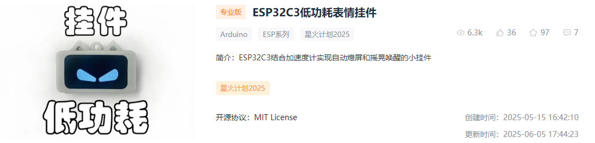
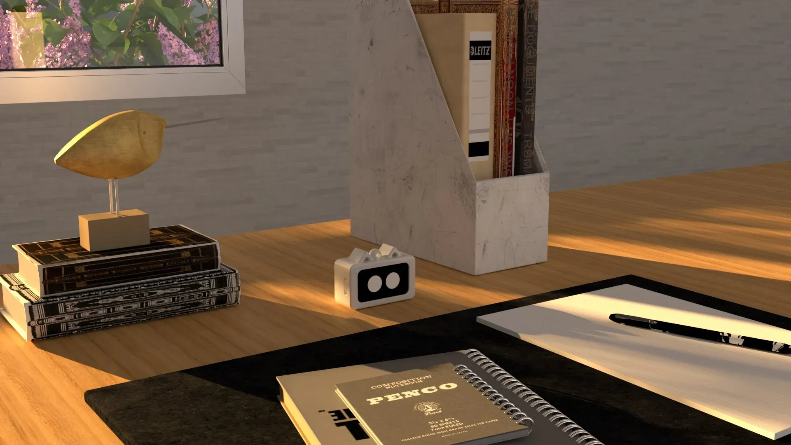
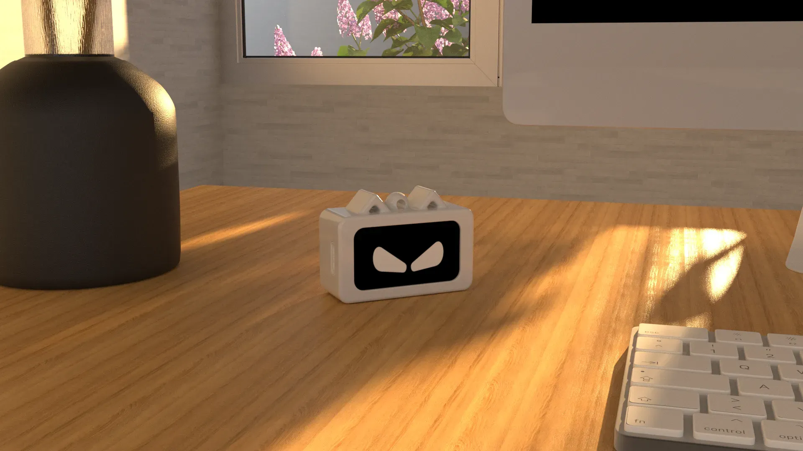
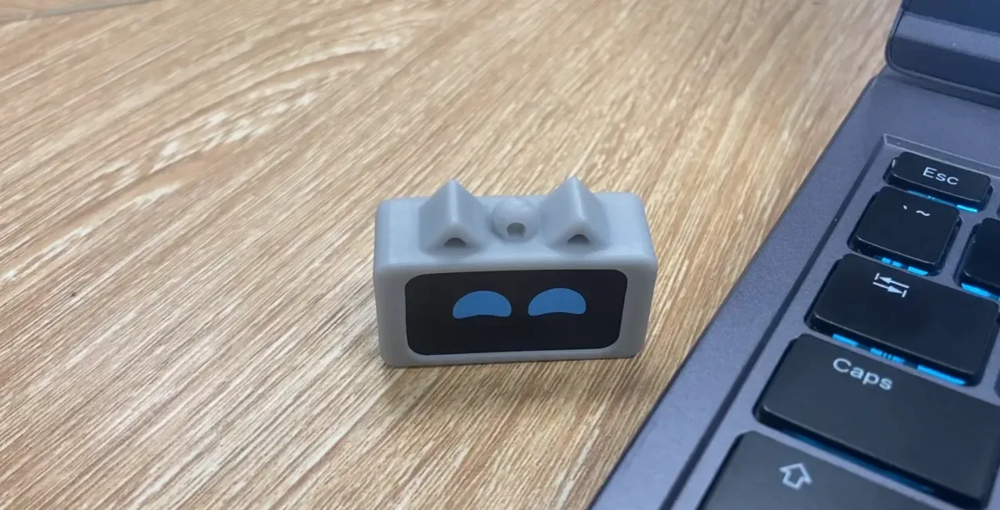
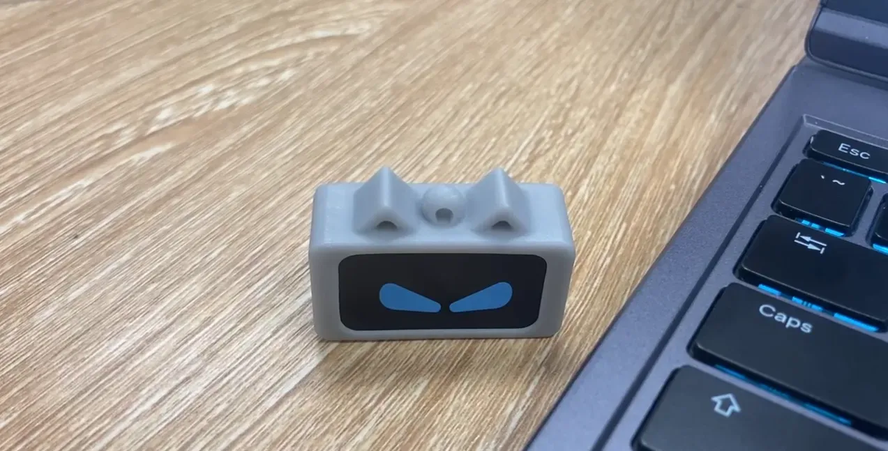
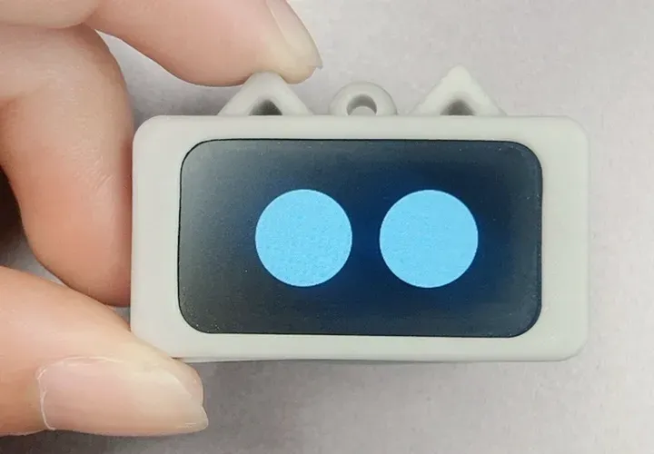
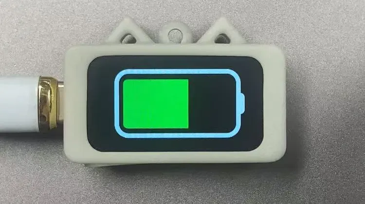
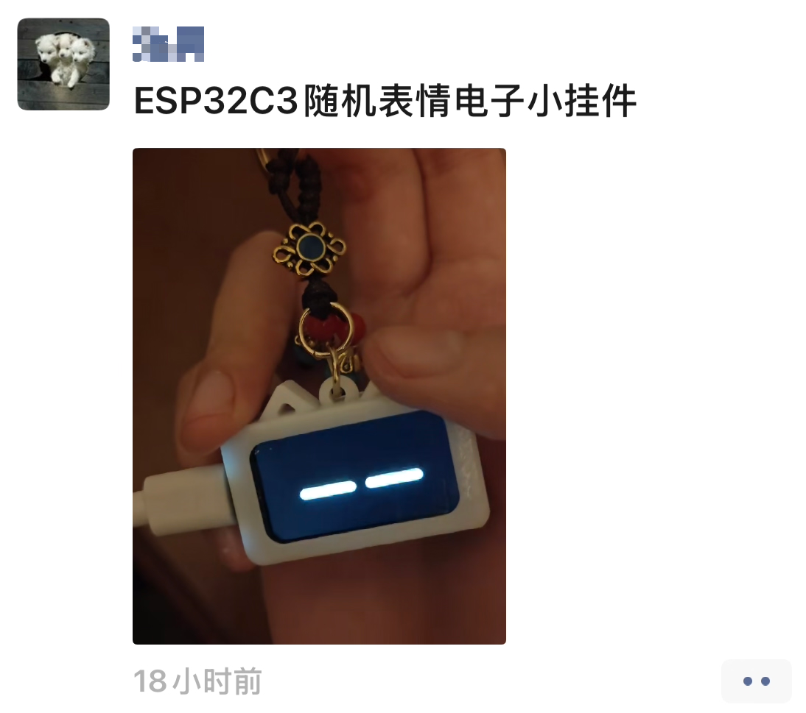
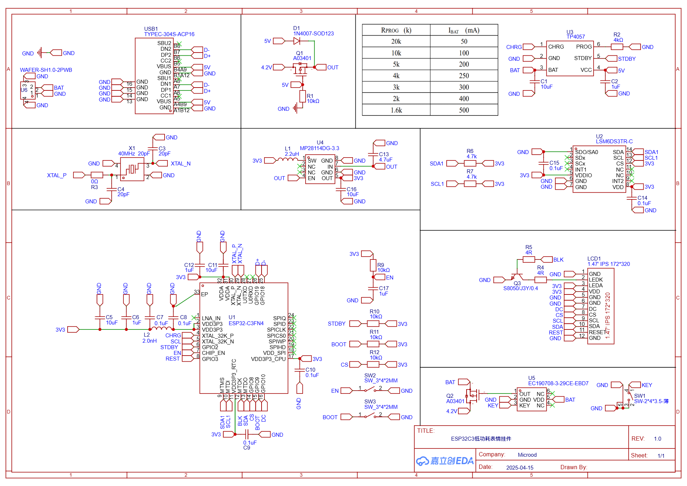
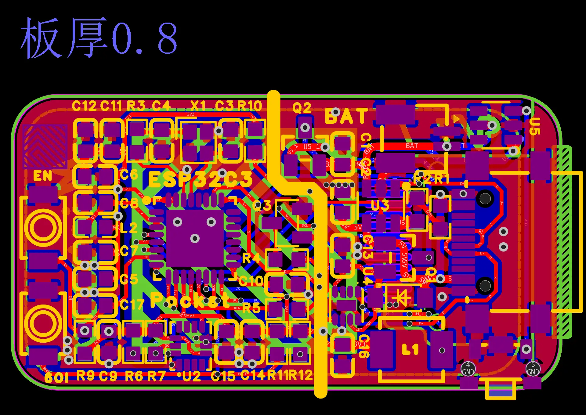

# Pocket — ESP32-C3 低功耗表情挂件

<div align="center">

**一个带动画表情、加速度计唤醒和 USB-C 充电的桌面小挂件**

[](https://www.arduino.cc/)
[](LICENSE)

[**English**](README.md)

</div>



## 特性

- **动画表情** — 6 种情绪 GIF（愤怒、不屑、惊恐、兴奋、难过、静态），在 1.47 英寸 IPS 屏幕上随机播放
- **摇晃唤醒** — LSM6DS3TRC 加速度计检测运动，10 秒无动作自动熄屏
- **充电动画** — 插入 USB-C 时显示电池充电动画
- **超低功耗** — 待机时关闭屏幕，摇一摇立即唤醒
- **3D 打印外壳** — 猫耳造型，提供 Rhino 源文件和可直接打印的 STL

## 展示

<table>
<tr>
<td></td>
<td></td>
<td></td>
</tr>
<tr>
<td></td>
<td></td>
<td></td>
</tr>
</table>

## 复刻示例



## 硬件参数

| 组件 | 规格 |
|------|------|
| 主控 | ESP32-C3FN4 |
| 屏幕 | 1.47" IPS ST7789 (172×320) |
| IMU | LSM6DS3TRC（六轴） |
| 充电 | TP4057，USB-C |
| 电池 | 3.7V 锂聚合物 |
| PCB 板厚 | 0.8mm |

## 电路设计

**原理图**



**PCB 布局**



## 项目结构

```
pocket/
├── Pocket/
│   ├── Arduino/
│   │   ├── Pocket.ino          # Arduino 固件
│   │   └── partitions.csv      # ESP32 分区表
│   ├── filesystem/
│   │   ├── flash.bat           # SPIFFS 烧录脚本
│   │   └── FS/
│   │       ├── spiffs.py       # SPIFFS 镜像生成器
│   │       ├── UpLoad.py       # 串口上传工具
│   │       └── SPIFFS/         # 固件用 GIF 资源
│   └── Emoji/                  # After Effects 动画源文件
├── hardware/
│   ├── model.3dm               # Rhino 3D 模型
│   ├── shell.stl               # 外壳（可直接打印）
│   └── back-cover.stl          # 后盖（可直接打印）
├── libs/                       # Arduino 库依赖
├── images/                     # 照片和截图
└── README.md
```

## 快速开始

### 1. 安装 Arduino 库

将 `libs/` 中的压缩包解压到 Arduino 库目录，或通过 Arduino 库管理器安装：
- **Arduino_GFX_Library** — 屏幕驱动
- **Adafruit_LSM6DS** — IMU 驱动
- **AnimatedGIF** — GIF 解码器（通过库管理器安装）

### 2. 烧录固件

1. 用 Arduino IDE 打开 `Pocket/Arduino/Pocket.ino`
2. 选择开发板：**ESP32C3 Dev Module**
3. 设置分区方案，使用自定义 `partitions.csv`
4. 上传

### 3. 烧录 SPIFFS（GIF 资源）

需要 Python 环境，先安装依赖：

```bash
pip install esptool
```

然后执行烧录：

```bash
cd Pocket/filesystem
flash.bat
```

该脚本会从 GIF 文件生成 SPIFFS 镜像并上传到 ESP32-C3。

## 表情列表

| 表情 | GIF 文件 | 触发方式 |
|------|----------|----------|
| 愤怒 | `anger.gif` | 唤醒时随机 |
| 不屑 | `disdain.gif` | 唤醒时随机 |
| 兴奋 | `excited.gif` | 唤醒时随机 |
| 难过 | `once.gif` | 唤醒时随机 |
| 静态 | `twece.gif` | 唤醒时随机 |
| 充电 | `charge.gif` | 插入 USB-C |

## 链接

- **PCB 开源地址**：[立创开源硬件平台](https://oshwhub.com/httppp/esp32c3-low-power-consumption-ex)
- **QQ 交流群**：1042593321

## 许可证

MIT License
