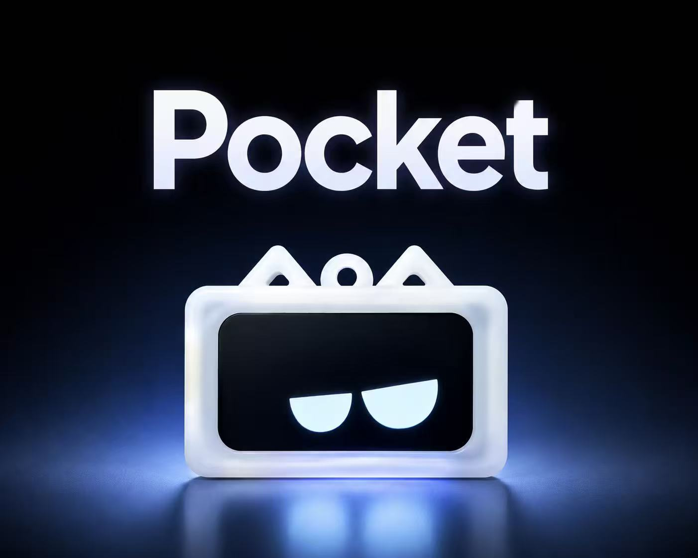
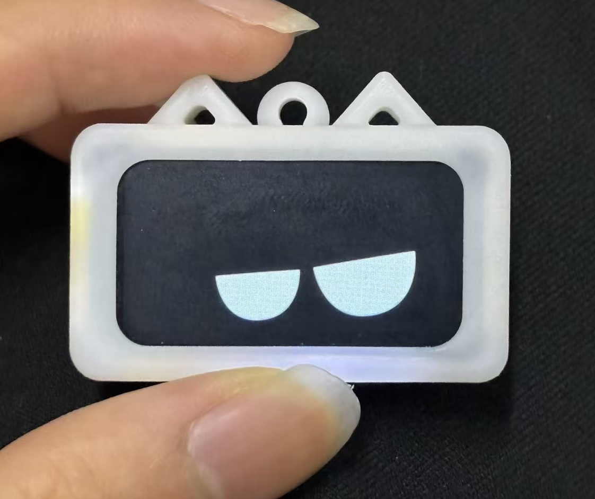
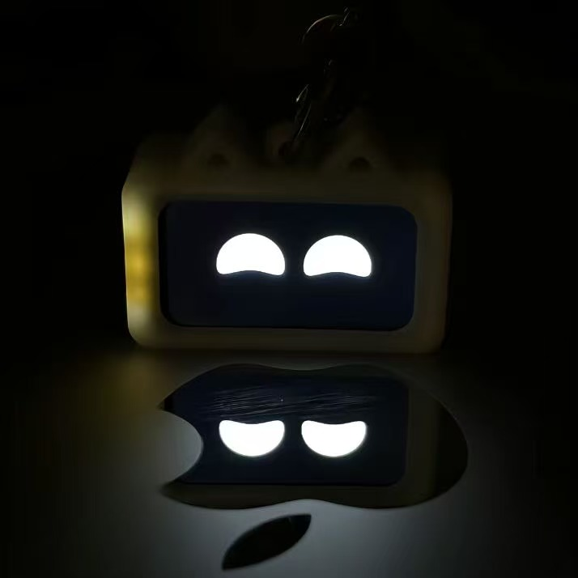
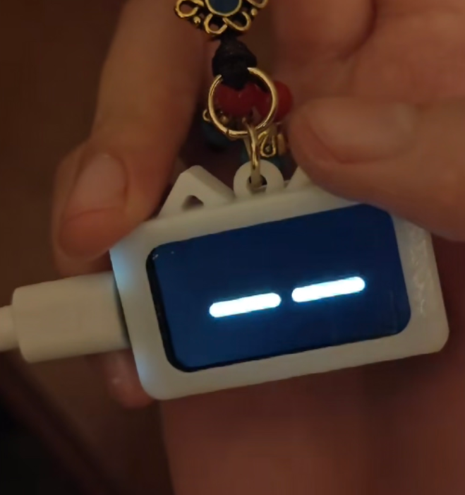
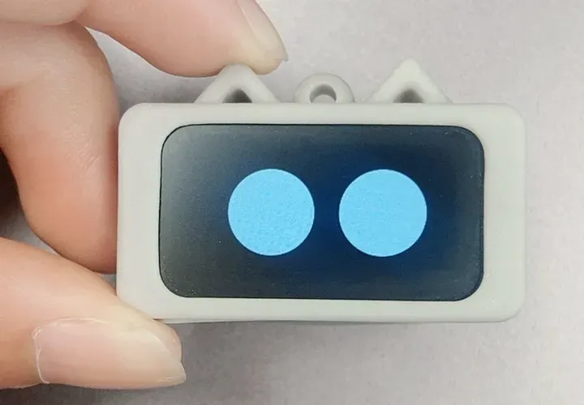
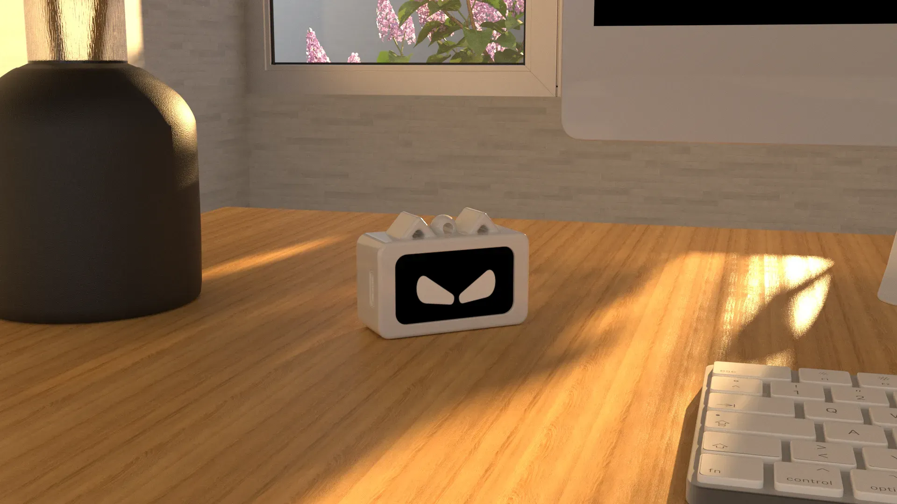
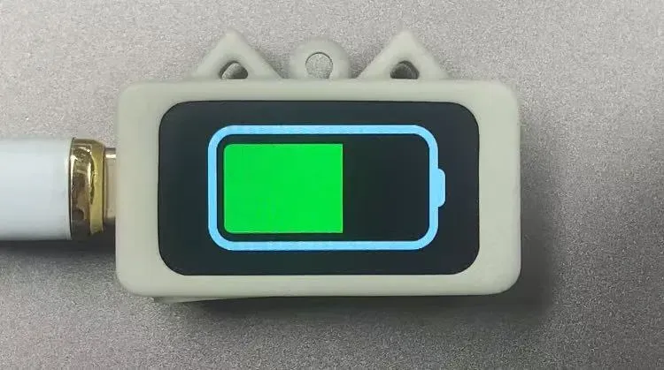

<div align="center">
  
</div>

<h1 align="center">Pocket V1.0 Emoji Pendant</h1>

<p align="center"><b>A tiny desk/backpack companion with animated expressions, shake-to-wake, and USB-C charging</b></p>

<p align="center">
  <a href="#-overview">Overview</a> &nbsp;|&nbsp;
  <a href="#-gallery">Gallery</a> &nbsp;|&nbsp;
  <a href="#-repository-structure">Structure</a> &nbsp;|&nbsp;
  <a href="#-quick-start">Quick Start</a> &nbsp;|&nbsp;
  <a href="#-links">Links</a>
</p>

<p align="center"><a href="README.md"><b>中文文档</b></a></p>

<p align="center">
  
  
  
  
  
</p>

---

## 📖 Overview

Pocket is a **thumb-sized electronic pendant** — clip it to your bag or sit it on your desk.

Inside is an ESP32-C3 chip and a 1.47" IPS display, randomly cycling through 6 hand-drawn expressions: angry, disdain, shocked, excited, sad, and a blinking idle face. Plug in USB-C and it switches to a charging animation.

Ignore it for 10 seconds and it dims to sleep. **Give it a shake and it wakes instantly** with a new expression. The enclosure is a 3D-printed cat-ear design — Rhino source files and STLs are open source.

Hardware, firmware, animation sources, 3D enclosure — **fully open source**. Flash with one click using pre-built firmware, or customize the code, draw new expressions, and 3D print your own shell.

<div align="center">
  <table>
    <tr align="center">
      <td width="110"><b>🧠 MCU</b><br>ESP32-C3FN4<br><sub>RISC-V</sub></td>
      <td width="110"><b>📺 Display</b><br>1.47" IPS<br><sub>172×320</sub></td>
      <td width="110"><b>🎯 Gyro</b><br>LSM6DS3TRC<br><sub>6-Axis IMU</sub></td>
      <td><b>🔋 Charging</b><br>TP4057<br><sub>USB-C</sub></td>
      <td><b>🎨 Expressions</b><br>6 GIFs<br><sub>+AE Sources</sub></td>
      <td><b>🖨️ Enclosure</b><br>3D Printed<br><sub>Cat-Ear Design</sub></td>
    </tr>
  </table>
</div>

---

## 📸 Gallery

<p align="center">
  <table align="center">
    <tr align="center">
      <td></td>
      <td></td>
      <td></td>
    </tr>
    <tr align="center">
      <td></td>
      <td></td>
      <td></td>
    </tr>
  </table>
</p>

---

## 📂 Repository Structure

```
pocket/
├── src/
│   ├── Pocket/               # Arduino firmware + partition table
│   ├── filesystem/           # SPIFFS build script + GIF source files
│   ├── Emoji/                # AE animation sources + MP4 previews (6 expressions)
│   └── release/              # Pre-built firmware + one-click flash tool
├── hardware/                 # 3D enclosure (Rhino + STL)
├── images/                   # Photos & screenshots
├── README.md
└── LICENSE
```

### 🎨 `src/Emoji/` — Expression Animation Sources

After Effects source files (`.aep`) and segmented animation previews (MP4) for all expressions. Each expression is split into three phases: "enter pose → loop cycle → return", making it easy to adjust timing and export GIFs.

Expression animations originated from [ZhiHuiJun (稚晖君)](https://github.com/peng-zhihui)'s open source project, adapted for this pendant. Huge thanks to ZhiHuiJun!

### 📦 `src/filesystem/` — Filesystem & Custom Expressions

Want to **swap or add new expressions**? Drop your GIF files into the `SPIFFS/` folder, run `build_spiffs.bat` to generate a new `fs.bin` image, and update the `GIF_LIST[]` array in `Pocket.ino`.

### 🔧 `src/Pocket/` — Arduino Firmware Source

Well-commented firmware with Chinese annotations. Covers display driver, IMU initialization, GIF decode callbacks, sleep/wake power saving — the full logic. Open in Arduino IDE and upload.

**Build Configuration (Arduino IDE → Tools):**

- **Board**: ESP32C3 Dev Module
- **USB CDC On Boot**: Enabled
- **CPU Frequency**: 80MHz (WiFi)
- **Flash Frequency**: 80MHz
- **Flash Mode**: DIO
- **Flash Size**: 4MB (32Mb)
- **Partition Scheme**: Default 4MB with spiffs (1.2MB APP / 1.5MB SPIFFS)
- **Upload Speed**: 921600
- **Core Debug Level**: None
- **Erase All Flash Before Sketch Upload**: Disabled

### 🚀 `src/release/` — Pre-Built Firmware

No dev environment? Just use this folder. Double-click `flash.bat` to auto-detect the serial port and flash firmware + all GIFs in one go. Manual override: `flash.bat COM5`.

---

## ⚡ Quick Start

### Zero Setup: Pre-Built Firmware

1. Open `src/release/`
2. Connect ESP32-C3 to your computer via USB
3. Double-click `flash.bat` → wait for completion → unplug and power on

> If auto-detection fails, manually specify: `flash.bat COM5`

### Customize: Build from Source

1. Install the following libraries and board package in Arduino IDE:
   - **Arduino_GFX_Library** — Moon — Recommends 1.5.0
   - **Adafruit LSM6DS** — Adafruit — Recommends 4.7.4
   - **AnimatedGIF** — Larry Bank — Recommends 1.4.7
   - **ESP32 Board Package** — Espressif — Recommends 3.1.0
2. Open `src/Pocket/Pocket.ino`, configure board settings as listed above
3. Upload firmware

---

## 🔗 Links

- **PCB Open Source**: [OSHWHub](https://oshwhub.com/httppp/esp32c3-low-power-consumption-ex)
- **BiliBili**: [Video](https://www.bilibili.com/video/BV1uZECzME1G/)
- **YouTube**: [Video](https://youtu.be/1sSGqthJN1I)
- **QQ Group**: 1042593321
